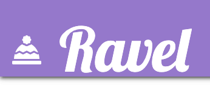

# Table of contents

1. <a href="#whatis">What is Ravel?</a>
1. <a href="#whatdo">What does it do?</a>
1. <a href="#how">How does it work?</a>
1. <a href="#creation">Creation & Design</a>
1. <a href="#strategy">Strategy</a>
1. <a href="#scope">Scope</a>
1. <a href="#structure">Structure</a>
1. <a href="#skeleton">Skeleton (Wireframes)</a>
1. <a href="#surface">Surface</a>
1. <a href="#features">Features</a>
1. <a href="#future">Future Features</a>
1. <a href="#defensive">Defensive Programming</a>
1. <a href="#responsive">Responsive Design</a>
1. <a href="#hardware">Hardware & Technology Used</a>
1. <a href="#testing">Testing</a>
1. <a href="#deployment">Deployment</a>
1. <a href="#credits">Credits</a>

Project Live Demo:<a href="#"> **RAVEL - BESPOKE KNITWARE STORE**</a>
</a>

## 
WHAT IS RAVEL?

Ravel is an efficient online store used to purchase custom knitware and accessories.  It provides a platform to order and purchase a full range of hand-knitted clothing and accessories. The project is a combination of HTML, CSS, JavaScript, and Python and utilizes a Django Framework.

## 
WHAT DOES IT DO?

It allows users to view, customise, order and purchase items that are made to order. It also has features that allow registered users to view previous orders and save delivery information.

## **HOW DOES IT WORK?**
There are 3 stages of access

1. **Unregistered Access:** This allows users to view all items and place orders without being able to save details or view previous orders. In future this could also limit their access to unique offers only available to registered users.
1. **Registered Access:** Once the user has logged in or registered, they can view their 'account' and see all previous orders as well as have their delivery information saved.
1. **Admin Access** Only admin can access the management view which has full CRUD functionality over all contents of the application including Users, Orders, Items etc. This view comes with Django as a framework.

## **Creation and Design**

### **Behaviour Driven Development vs Test Driven Development or Acceptance Test Driven Development**

Due to the complexity of the application, test driven development was paramount when developing the system. The behaviour needed to match the users needs while the functionality needed to pass essential tests. In addition to providing full viewing, ordering and purchasing functionality.

### **UX - STRATEGY:**

The application is designed to provide an essential service to users looking for custom knitware specifically for babies or young children.

**_BUSINESS GOALS OF APPLICATION_**
- To provide an efficient e-commerce web application
- To advertise custom knitware items 
- To provide users the choice of size and color of items
- To sell custom knitware items
- To promote the business of Ravel and its founder
- To CREATE, READ and DELETE Product Information
- To CREATE, READ and DELETE User Information
- To CREATE, READ and DELETE Order Information

**_USER GOALS OF APPLICATION_**
- To learn about Ravel and its founder
- To VIEW all products
- To EDIT the color, size or quantity of an order
- To ORDER any item
- To PURCHASE my order
- To have the option REGISTER for the website
- To VIEW previous orders made by me
- To update my Delivery Information

**_WHO IS THE USER?_**

- The ideal user for Ravel:
  - Over the age of 16
  - Has disposable income
  - Needs to purchase a gift or item for friend or famil member
  - Needs an online platform to purchase knitted goods

### **UX - SCOPE:**
**Business Intentions**

The Register/Log In feature is utilised in this application as it encourages data capture in exchange for added features. The added features that registering allow access to include:
- Saving and viewing order history
- Saving and editing Delivery Details
- Faster Checkout Process due to saved details
- Future benefits may include discounts/offers for ONLY registered users

Although registering is also free the user must give their full name and email address which has the scope in the future to be utilised for news, updates and marketing purposes.

**What do the NEW users want?**
- Users that are new to the application will want to navigate throughout the site easily and intuatively. They want to find and view products with the option of choosing size, color and quantity to purchase.

**What do the RETURNING users want?**
- Returning users want to log in easily to their profile on the application to use the application as a registered user with access to order history.

**USER STORIES**`

1. As a new or returning user i want to navigate the application easily
1. As a new user i want the option to register to the site
1. As a returning user i want the option to login to the application
1. As a returning user i want to view my previous orders
1. As a new or returning user i want to view all products in the store
1. As a new or returning user i want to easily search through all the products on the application
1. As a new or returning user i want to view product categories
1. As a new or returning user i want to view a product that has clear information including image, price and description
1. As a new or returning user i want to add a product to my basket
1. As a new or returning user i want to remove a product from my basket
1. As a new or returning user i want to change the quantity of items in my basket
1. As a new or returning user i want to delete all items from my basket
1. As a new or returning user i want to place my order and purchase using my Credit/Debit card
1. As a new or returning user i want to view my order summary and recieve an email confirmation

**ADMIN USER STORIES**`
1. As an admin user i want to view users, products and orders 
1. As an admin user i want to have full control over the e-commerce store
1. As an admin user i want to add a new product
1. As an admin user i want to delete an existing product
1. As an admin user i want to modify an order
1. As an admin user i want to modify user details

### **UX - STRUCTURE:**

The next plane to approach was Structure. What the application will do and and the external factors that might affect it.
This allowed an insight into the user experience and how a visitor uses the application.

**Here is the link to the structural sitemap:**
<a  href="#" target="_blank">SITEMAP</a>

Structure:

The application uses Django. 

Within the Ravel Project their are 5 models

1. Product
1.  Size
1. Color
1. Orders
1. User Profile 

    

### **UX - SKELETON:**

The skeleton of this project was designed and established using Balsamiq (Cloud): https://balsamiq.cloud/

### **Wireframe Designs**

All wireframe designs can be found here:

Mobile: <a href="#">Mobile Wireframe Designs</a>

Desktop: <a href="https://github.com/DanielBradford/rubric/blob/c4a2399f3f18880deb4bf009fe06c59fb35feba8/documents/wireframes/RUBRIC%20DESKTOP%20WIREFRAMES.pdf">Desktop Wireframe Designs</a>

### **UX - SURFACE:**

The final element to consider was the surface plane of UX design. This is the look and feel of the application.
Below are some screen shots of the application in use:

## **Style / Theme**

- It was important to me that the application remained gender neutral in order to maximise potential user scope. Upon researching current applications it appears many have a feminine tone which might discourage male users. From the start i intended the site to be bright, fun and intuitive.
The main COLOR scheme used includes:
- **Purple** (#9575cd)
- **Blue** (#4dd0e1)
- **Peach** (#ffcc80)
As the application is centered around knitware and babywear i used a wooly hat Symbol as the main logo.
The FONTS used were from Google Fonts:
- **Bad Script**
- **Lobster**
To maintain the idea of being approachable, bright and friendly i used supporting colors for icons and buttons:
- **Teal**
- **Dark Purple**
- **Orange**
This was maintained through out the application using a mix of customised CSS and Materialize framework.

## **Features**

### **Repeating Features**

### The following features are repeated across the application allowing a consistent design format for the user to feel comfortable and familiar;

