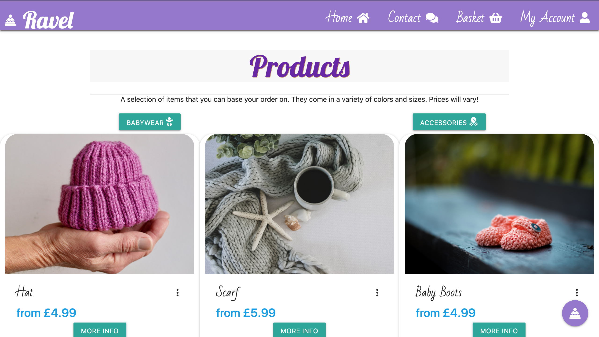

# Table of contents

1. <a href="#whatis">What is Ravel?</a>
1. <a href="#whatdo">What does it do?</a>
1. <a href="#how">How does it work?</a>
1. <a href="#creation">Creation & Design</a>
1. <a href="#strategy">Strategy</a>
1. <a href="#scope">Scope</a>
1. <a href="#structure">Structure</a>
1. <a href="#skeleton">Skeleton (Wireframes)</a>
1. <a href="#surface">Surface</a>
1. <a href="#features">Features</a>
1. <a href="#future">Future Features</a>
1. <a href="#defensive">Defensive Programming</a>
1. <a href="#responsive">Responsive Design</a>
1. <a href="#hardware">Hardware & Technology Used</a>
1. <a href="#testing">Testing</a>
1. <a href="#deployment">Deployment</a>
1. <a href="#credits">Credits</a>

Project Live Demo:<a href="#"> **RAVEL - BESPOKE KNITWARE STORE**</a>
</a>

## 
WHAT IS RAVEL?

Ravel is an efficient online store used to purchase custom knitware and accessories.  It provides a platform to order and purchase a full range of hand-knitted clothing and accessories. The project is a combination of HTML, CSS, JavaScript, and Python and utilizes a Django Framework.

## 
WHAT DOES IT DO?

It allows users to view, customise, order and purchase items that are made to order. It also has features that allow registered users to view previous orders and save delivery information.

## **HOW DOES IT WORK?**
There are 3 stages of access

1. **Unregistered Access:** This allows users to view all items and place orders without being able to save details or view previous orders. In future this could also limit their access to unique offers only available to registered users.
1. **Registered Access:** Once the user has logged in or registered, they can view their 'account' and see all previous orders as well as have their delivery information saved.
1. **Admin Access** Only admin can access the management view which has full CRUD functionality over all contents of the application including Users, Orders, Items etc. This view comes with Django as a framework.

## **Creation and Design**

### **Behaviour Driven Development vs Test Driven Development or Acceptance Test Driven Development**

Due to the complexity of the application, test driven development was paramount when developing the system. The behaviour needed to match the users needs while the functionality needed to pass essential tests. In addition to providing full viewing, ordering and purchasing functionality.

### **UX - STRATEGY:**

The application is designed to provide an essential service to users looking for custom knitware specifically for babies or young children.

**_BUSINESS GOALS OF APPLICATION_**
- To provide an efficient e-commerce web application
- To advertise custom knitware items 
- To provide users the choice of size and color of items
- To sell custom knitware items
- To promote the business of Ravel and its founder
- To CREATE, READ and DELETE Product Information
- To CREATE, READ and DELETE User Information
- To CREATE, READ and DELETE Order Information

**_USER GOALS OF APPLICATION_**
- To learn about Ravel and its founder
- To VIEW all products
- To EDIT the color, size or quantity of an order
- To ORDER any item
- To PURCHASE my order
- To have the option REGISTER for the website
- To VIEW previous orders made by me
- To update my Delivery Information

**_WHO IS THE USER?_**

- The ideal user for Ravel:
  - Over the age of 16
  - Has disposable income
  - Needs to purchase a gift or item for friend or famil member
  - Needs an online platform to purchase knitted goods

### **UX - SCOPE:**
**Business Intentions**

The Register/Log In feature is utilised in this application as it encourages data capture in exchange for added features. The added features that registering allow access to include:
- Saving and viewing order history
- Saving and editing Delivery Details
- Faster Checkout Process due to saved details
- Future benefits may include discounts/offers for ONLY registered users

Although registering is also free the user must give their full name and email address which has the scope in the future to be utilised for news, updates and marketing purposes.

**What do the NEW users want?**
- Users that are new to the application will want to navigate throughout the site easily and intuatively. They want to find and view products with the option of choosing size, color and quantity to purchase.

**What do the RETURNING users want?**
- Returning users want to log in easily to their profile on the application to use the application as a registered user with access to order history.

**USER STORIES**`

1. As a new or returning user i want to navigate the application easily
1. As a new user i want the option to register to the site
1. As a returning user i want the option to login to the application
1. As a returning user i want to view my previous orders
1. As a new or returning user i want to view all products in the store
1. As a new or returning user i want to easily search through all the products on the application
1. As a new or returning user i want to view product categories
1. As a new or returning user i want to view a product that has clear information including image, price and description
1. As a new or returning user i want to add a product to my basket
1. As a new or returning user i want to remove a product from my basket
1. As a new or returning user i want to change the quantity of items in my basket
1. As a new or returning user i want to delete all items from my basket
1. As a new or returning user i want to place my order and purchase using my Credit/Debit card
1. As a new or returning user i want to view my order summary and recieve an email confirmation

**ADMIN USER STORIES**`
1. As an admin user i want to view users, products and orders 
1. As an admin user i want to have full control over the e-commerce store
1. As an admin user i want to add a new product
1. As an admin user i want to delete an existing product
1. As an admin user i want to modify an order
1. As an admin user i want to modify user details

### **UX - STRUCTURE:**

The next plane to approach was Structure. What the application will do and and the external factors that might affect it.
This allowed an insight into the user experience and how a visitor uses the application.

**Here is the link to the structural sitemap:**
<a  href="#" target="_blank">SITEMAP</a>

Structure:

The application uses Django. 

Within the Ravel Project their are 5 models

1. Product
1. Size
1. Color
1. Orders
1. User Profile 

    

### **UX - SKELETON:**

The skeleton of this project was designed and established using Balsamiq (Cloud): https://balsamiq.cloud/

### **Wireframe Designs**

All wireframe designs can be found here:

Mobile: <a href="https://github.com/DanielBradford/ravel/blob/999f5ee2bede1563af15b59a227fefc638cf8caa/documents/wireframes/MOBILE%20WIREFRAMES.png">Mobile Wireframe Designs</a>

Desktop: <a href="https://github.com/DanielBradford/ravel/blob/999f5ee2bede1563af15b59a227fefc638cf8caa/documents/wireframes/DESKTOP%20WIREFRAME.png">Desktop Wireframe Designs</a>

### **UX - SURFACE:**

The final element to consider was the surface plane of UX design. This is the look and feel of the application.
Below are some screen shots of the application in use:

## **Style / Theme**

- It was important to me that the application remained gender neutral in order to maximise potential user scope. Upon researching current applications it appears many have a feminine tone which might discourage male users. From the start i intended the site to be bright, fun and intuitive.
The main COLOR scheme used includes:
- **Purple** (#9575cd)
- **Blue** (#4dd0e1)
- **Peach** (#ffcc80)
As the application is centered around knitware and babywear i used a wooly hat Symbol as the main logo.
The FONTS used were from Google Fonts:
- **Bad Script**
- **Lobster**
To maintain the idea of being approachable, bright and friendly i used supporting colors for icons and buttons:
- **Teal**
- **Dark Purple**
- **Orange**
This was maintained through out the application using a mix of customised CSS and Materialize framework.

## **Features**

### **Repeating Features**

### The following features are repeated across the application allowing a consistent design format for the user to feel comfortable and familiar;

### Navigation

- **Mobile** The navigation menu is represented by the hamburger icon. The mobile menu uses Materialize JS and is displayed in a user-friendly and stylish format.
- **Desktop** The navigation menu is clear and accessible. When hovered over the links are highlighted.
- **Floating Menu** 
  This is located in the lower right corner of the screen and allows quick access to the following:
   <ul style="width:50%"> 
        <li>Babywear</li>
        <li>Accessories</li>
        <li>Contact</li>
        <li>My Basket</li>
        <li>Saved Recipes (Yellow Thumbtack icon)</li>
    </ul>

  **There is an additional option of my account if the user is logged in.**
   

    The placement of the floating menu is positioned using the Gestalt theory and principle of proximity. Lower right corner is intuitive for users.

### Footer

- **Social Media Icons:** These icons when clicked take the user (on a new page) to the corresponding website for that social media e.g. LinkedIn of Creator & Instagram of Ravel.

## USER FEATURES

### **Login Feature**
This allows registered members to login into application in order to access the extra features. This contains back-end verifcation that checks if the username exists in the database.

If the unhashed password in the database matches the user's password, they are then able to login.

Access with extension of: /accounts/login/

### **Register Feature**

This allows new users to register so they can view order history and dave delivery information. The data entry form has front-end and back-end validation to ensure full protection and help prevent user error.

Access with extension of: /accounts/signup/

 

### **Products Page**
The products page is the main dashboard for all the products on offer for purchase. 

There is a control panel that presents 2 buttons which index the items displayed by category. Babywear and Accessories.

The products are displayed as tiles and allow two ways to order.

1. Quick Purchase: By clicking on the image the user can select their preferred color, size and quantity of item and add to basket.

1. More Info: Redirects the user to a products details that breaks down the information about the product. In this page they can also place an order. See next section.

### **Product Details Page**
The product details page is the product specific page that gives more information about the product on offer.

The user can pick the color (based on the contents of the Color Model)

The user can pick the size (based on the contents of the Size Model)

They then select the quantity and can add to basket. **Important** The maxiumum amount that can be added is 3. This is due to the items being handmade by the sole owner and founder of Ravel:

### **My Basket Page**
The basket page lists all the orders the user has placed in their basket where they can:
- Review current item orders in basket
- Update quantity within the order
- Remove (Either all products or individual items) 
- Continue to checkout.

### **Checkout Page**
The checkout page gives a summary of their basket and allows the user to enter their information to complete the order. This includes:
- Name
- Email Address
- Delivery / Billing Address
- Payment Information **This is done using Stripe (https://stripe.com/)**

### **Checkout Success Page**
The checkout success page is only shown when the payment is approved and the order is successful.
The page summarises:
- The order
- The payment / consistent
- Informs the user that the order will also be confirmed by email

### **Contact Us Page**
This page is still in development and is intended for users to contact the owner/founder for any orders, enquiries or information that is not featured in the website. This can be considered as a future feature to enhance the existing site. EmailJS (https://www.emailjs.com/) would be used to enable the functionality for this.

## **REGISTERED USER FEATURES**

## **My Profile Page**
The profile page allows the user to view order history and saved delivery information. 
The page lists all order history relevant to the user.

 

## **ADMIN / MANAGEMENT FEATURES**

Admin can be accessed with the extension of: /admin/

This is a feature of the Django Framework which allows the Admin user full control over the website users and content.

In this view the admin user can:
- Verify User Email Addresses
- Create, Read, Update and Delete Users.
- Create, Read, Update and Delete Orders
- Create, Read, Update and Delete Products (including Color and Size Models)

## **Users**

### ADD USER
URL extension: /admin/auth/user/add/

### EDIT USER
URL extension: /admin/auth/<user-reference>/change/

### DELETE USER
URL extension: admin/auth/<user-reference>/delete/

## Products

The products table displays all products and when selected a breakdown of the product information including:

### ADD Product
URL extension: /admin/auth/<product-reference>/add/

### EDIT USER
URL extension: /admin/auth/<product-reference>/change/

### DELETE USER
URL extension: admin/auth/<product-reference>/delete/

## Orders
This table displays all orders placed through Ravel. 

### ADD ORDER
URL extension: /admin/checkout/order/add/

### DELETE ORDER
URL extension: /admin/checkout/order/<order-reference>/delete/

### UPDATE ORDER
URL extension: /admin/checkout/order/40/change/

### **Search Users / Products / Orders**
In the admin view the user can search within the index of the record and the results are displayed in the table below

## **FUTURE FEATURES**

- Comment Section on products page to leave feeback for orders
- Messaging system and Inbox for  registered users to allow customer base to communicate
- Offers / Vouchers presented to registered users
- Rewards system for customers in a spending Category

## **Defensive Programming**
Django framework used allows secutiry and protection to be included in the application.

For example the need of CSRF Token for forms that deal with important data. 

A primary objective when developing this application from a defensive design standpoint was to limit the users access and prevent the system breaking due to user input or malicious activity. 

As the application deals with payment and finance it is imperitive that both the user and data security is maintained and protected.

Back-end routing checks prevent any cross site activity that may result in unwanted behaviour from a malicious user.

*For details on defensive design testing, please see <a href="https://github.com/DanielBradford/ravel/blob/master/testing.md" target="_blank">testing section</a>.

## **Responsive Design**

   

The application has been built using a device-first approach. The Materialize grid system was utilized to maintain the responsiveness of this application accross all screen sizes. Throughout the development process, chrome developer tools, multiple desktops and mobile devices
where used to ensure responsivness across all screen resolutions. *(The application was also tested by family and friends using various devices and browsers.)*

Please see the <a href="https://github.com/DanielBradford/ravel/blob/master/testing.md" target="_blank">TESTING.md</a> file for more information

## **Hardware Used**

- ### **MacBook Pro (Retina, 13-inch, Mid 2014)**

## **Technologies Used**
IDE:
- ### **Gitpod** - https://gitpod.io/
Version Control:
- ### **Git** https://git-scm.com/
- ### **GitHub** https://github.com/
Deployment: 
- ### **Heroku** https://www.heroku.com

Languages:
- ### **HTML / HTML5**
  - Used to create the structure of the pages
- ### **CSS / CSS3**
  - Used to style the elements and customise layout. e.g. Color Schemes, design elements
- ### **Javascript**
- ### **JQuery**
  - Used to enhance the interactivity
- ### **Python (3)** 
  - For all application functionality and databse interaction

Frameworks/Libraries:

- ### **Materialize** 1.0.0 (CSS & Javascript/JQuery) https://materializecss.com/
  - Used mainly for responsive design and layout. Other elements used were Tables and Modals
- ### **Font Awesome** - v5.10.0 https://fontawesome.com/
  - All icons used in this project were from Font Awesome
- ### **Django** 3.1.3 https://www.djangoproject.com/
- ### **Lighthouse Analytics** (DevTools)
  - This was used to analayse the performance, accessiblity, best practices and SEO scores of the site. (Accessibility Testing)

Requirements.txt:

 

## **TESTING**

### Please refer to <a href="https://github.com/DanielBradford/ravel/blob/master/testing.md" target="_blank">TESTING.md</a> for a full testing breakdown

## **Deployment**

This project was **developed** using a <a href="https://gitpod.io/" target="_blank">GITPOD IDE</a>, committed to git and pushed to <a href="https://github.com/" target="_blank">GitHub</a> using the built in terminal feature.

- To add:
  - git add "filename"
- To commit:
  - git commit "filename" -m "unique message for commit"
- To push:
  - git push

This project was **deployed** using **HEROKU**.

**How to deploy to Heroku using GitPod:**

1. Created a new application using the Heroku dashboard.
2. Go to settings tab, click on 'reveal config vars' and add config vars such as IP (0.0.0.0), PORT (5000), STRIPE API Keys, Secret Keys, Email Hosting Keys etc.
3. Install Heroku via the console using 'pip3 install -g Heroku'.
4. Log into Heroku via the console using 'heroku login' and follow the on screen instructions to log in.
5. Create a requirements.txt via the console using 'pip3 freeze > requirements.txt'.
6. Create a Procfile via the console using 'echo web: python app.py > Procfile'.
7. Connect GitHub to Heroku via the console using 'heroku git:remote a ravel-e-store'
8. Commit all files in your project via the console using 'git add .' and 'git commit -m "Message"'.
9. Deploy your project to Heroku via the console using 'git push heroku master'.

**AWS was used to host media and static files**
https://docs.aws.amazon.com/s3/?id=docs_gateway

### **To run locally:**

To clone this project from GitHub:

1. Follow this link to the <a href="#" target="_blank">Project GitHub repository</a>.
1. Under the repository name, click **"Clone or download"**.
1. In the Clone with HTTPs section, copy the clone URL for the repository.
1. In your local IDE open Terminal/Git Bash.
1. Change the current working directory to the location where you want the cloned directory to be made.
1. Type git clone, and then paste the URL you copied in Step 3.
   - **e.g. "git clone https://github.com/DanielBradford/Ravel"**
1. Press _**Enter**_. Your local clone will be created.
1. To cut ties with this GitHub repository, type git remote rm origin into the terminal.

**Further reading and troubleshooting on <a href="https://help.github.com/en/github/creating-cloning-and-archiving-repositories/cloning-a-repository" target="_blank">cloning a repository from GitHub here.</a>**

## **Credits**
Content :
- Materialize was heavily utilised in this project 
- Unsplash for Images
- QR CODE GENERATOR : https://www.the-qrcode-generator.com/

For continual guidance:
- Brain Macharia (CI Mentor)
- Code Institute Support Team
- Stack Overflow (https://stackoverflow.com/)
- W3 Schools (https://www.w3schools.com/)

<a href="#top">BACK TO TOP</a>

