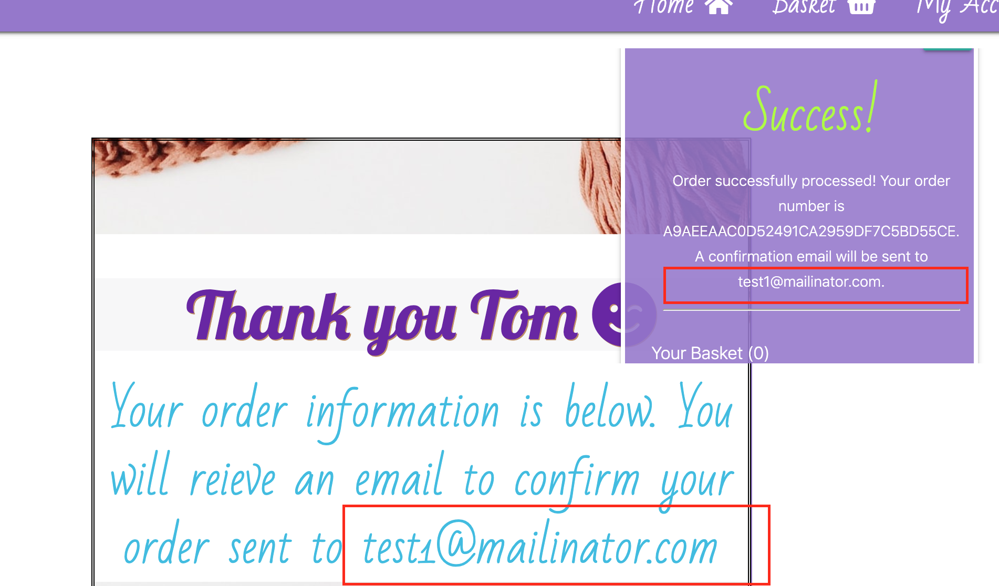

# **
 Testing 
**

# Table of contents

1. <a href="#valid">Code Validation</a>
1. <a href="#error">Error Testing</a>
1. <a href="#nav">Navigation Testing</a>
1. <a href="#story">User Story Testing</a>
1. <a href="#crud">C.R.U.D Testing</a>
1. <a href="#js">Javascript / JQuery Testing</a>
1. <a href="#responsive">Responsive Design Testing</a>
1. <a href="#bugs">De-bugging</a>
1. <a href="#future">Future Issues</a>
1. <a href="#devtool">DevTool Testing</a>
1. <a href="#further">Further Testing</a>

**HTML VALIDATION** - https://validator.w3.org/

- All HTML written in this project has been submitted for validation via the above software.

- Due to the framework to test HTML the project was deployed and the output source code was tested .

**CSS VALIDATION** - https://jigsaw.w3.org/css-validator/

- All CSS written in this project has been submitted for validation and passed via the above software.

**JAVASCRIPT VALIDATION** - https://jshint.com/

- ALL JS written in this project has been parsed through JSHint and no errors have been found.

        Metrics:
        There are 32 functions in this file. Function with the largest signature take 0 arguments, while the median is 0. Largest function has 33 statements in it, while the median is 2. The most complex function has a cyclomatic complexity value of 2 while the median is 1.

**PYTHON VALIDATION** - http://pep8online.com/

- ALL Python written in this project has been parsed  and linted using pep8 online and gitpod and no errors have been found. Upon scanning some lines of code needed to be shortened.

### **Error Testing**

In the eventuality of an error 400, 404, 500 or otherwise it was needed to provide a page the user is directed to. 

I tested this by intentionally entering a non-existent URL. The application passed this test by presenting the 404 page supplied by django. I would like to have created my own page that match the website theming and redirected the user to a correct URL pathway.

### **Navigation Testing**

- Mobile/Tablet Menu PASSED 
    - The hamburger menu icon is visible and functions
    - Appropriate links are shown/hidden depending on user
    - All text and icons are visible and appropriate sizes
    - All navigation links successfully direct the user to corresponding pages

- Desktop Menu PASSED 
    - All links highlight and apply intended CSS
    - Appropriate links are shown/hidden depending on user 
    - All text and icons are visible and appropriate sizes
    - All navigation links successfully direct the user to corresponding pages

- Floating Action Button Menu PASSED 
    - Menu successfully opens and closes on press/click
    - All buttons have clear icons
    - All buttons lead to corresponding pages

### **User Story Testing:**

1. As a new or returning user i want to navigate the application easily
   
    PASSED *The menu/nav bar functions for all screen sizes and the added floating menu enhances this experience. All navigation links successfully direct the user throughout the application*
1. As a new user i want the option to register to the site
    
    PASSED The registration page allows this. The functionality was tested by intentionally inputting data of various lengths and content. The registration validation passed this  manual test. The usermust validate their email address through the registartion process.
1. As a returning user i want the option to login to the application

    PASSED *The login page allows this. This was tested by intentionally inputting correct and incorrect usernames and passwords. The login validation passed this manual test. There is also the option to reset a forgotten password.*
    

1. As a returning user i want to view my previous orders

    PASSED The My profile page allows this. In the my profile page (https://ravel-online.herokuapp.com/profile/), all previous orders of user are displayed in a table and the number of orders are shown in the header:

    

1. As a new or returning user i want to view all products in the store

     PASSED The PRODUCTS page allows this. In the products page (https://ravel-online.herokuapp.com/products/), all products are displayed clearly with information on price, description and image:

     

1. As a new or returning user i want to easily search through all the products on the application

    PASSED The HOME page and PRODUCTS page allows this. Both pages include a search bar feature in which both product name and description are searched for matching arguments:

     

1. As a new or returning user i want to view product categories

    PASSED On the home page and products page there are buttons/tabs that present the products based on category. These include Babywear, All Products and Accessories:

     

1. As a new or returning user i want to view a product that has clear information including image, price and description

    PASSED On the product details page the product selected is presented with clear Image, Description, Price etc:

     

1. As a new or returning user i want to add a product to my basket

    PASSED When the add to basket button is selected in either the product or product details page, the related item with selected color, size and quantity is successfully added to basket. The user is notified with a pop up message (toast).

    
    
    
    The addition is viewable here https://ravel-online.herokuapp.com/orders/

    

1. As a new or returning user i want to remove a product from my basket & As a new or returning user i want to delete all items from my basket. 

    PASSED The remove icon in the basket page allows users to remove the individual order item from the basket. There is also a delete all orders button which removes the entire contents of the basket. Both are followed by a confirmation alert window to prevent accidental removal.

    

    

1. As a new or returning user i want to change the quantity of items in my basket.

    PASSED There is an intuitive feature to increase or decrease the quantity value for each order item which is confirmed with the update button:

    

1. As a new or returning user i want to place my order and purchase using my Credit/Debit card

    PASSED To complete the order the user must enter their Credit/Debit Card information in the order form. This includes the 16 Digit card number, expiry date and the 3 digit security number. Stripe functionality enables that valid card details are entered.

    Card Details Entry:
    
    Valid Card Entry:
    
    Invalid Card Entry:
    

1. As a new or returning user i want to view my order summary and recieve an email confirmation

    PASSED After a successful order has been placed the user is redirected to an order success page and they are sent an email to confirm order details.

    
    
    

**ADMIN USER STORIES**`
1. As an admin user i want to view users, products and orders 

    PASSED

1. As an admin user i want to have full control over the e-commerce store

    PASSED

1. As an admin user i want to add a new product

    PASSED

1. As an admin user i want to delete an existing product

    PASSED

1. As an admin user i want to modify an order

    PASSED

1. As an admin user i want to modify user details

    PASSED

### **CRUD FUNCTIONALITY TESTING**
CREATE:  PASSED

- All creation functionality for products, users and orders was successful and reflected in the Admin database:

READ: PASSED

- All data was successfully presented to the user and is accurate to all data stored in the Django and Stripe Data. 

UPDATE: PASSED

- All update functionality for editing products, orders and users, tested as successful and the database stored the data accordingly 

DELETE: PASSED

- All functionality for deleting products, users and orders was successful along with all Javascript confirmations. Further testing was needed for XSS attacks. (Cross Site Scripting)

### **JAVASCRIPT/JQUERY INTERACTIVITY TESTING** PASSED

ALL Javascript interactivity passed testing. This included:

- All MATERIALIZE javascript/JQUERY e.g. Modals & Navigation
- Toggles and Drop Downs
- Form Submissions
- Show/Hide functionality
- Action Confirmations (Toasts)

### **DELETION CONFIRMATION TESTING**  (Javascript)  PASSED
All Javascript Confirm functionality was used to prevent user error. This was tested by trying to delete an order item or basket contents without having to confirm.

On every test the user had to confirm before deletion.

## Responsive Design Testing PASSED

For final testing [Responsinator](https://www.responsinator.com/) was used to test the application accross multiple devices.

### Screen Size Testing/Compability

Screen Size         | Size              | Comments
--------------------|-------------------|---------
X-Small             | <768px            | No space between buttons for landing template. Grid layout altered to rectify PASSED
Small               | >=768px           | Landing page stats given flow-text attr. to prevent distortion PASSED
Medium              | >=992px           | Passed, no changes neccessary. PASSED
Large               | >=1200px          | Passed, no changes neccessary. PASSED

Commit Examples:

    commit 851d9584e940848d524e4bbfac4eea48c5db2b85
    Author: Daniel Bradford <danielbradford@hotmail.co.uk>
    Date:   Sat Mar 20 16:37:06 2021 +0000

    responsive design adjustments

    commit f8cad7cabe1d025a3d66374e7b329e46f809ad4e
        Author: Daniel Bradford <danielbradford@hotmail.co.uk>
        Date:   Sun Mar 21 11:31:37 2021 +0000

    Fixed small webhook issue. Linked buttons and modified for repsonsive design

    commit 95e477fa1c8d6f84dec5281f12d5c121305bb221
    Author: Daniel Bradford <danielbradford@hotmail.co.uk>
    Date:   Sat Mar 20 16:29:33 2021 +0000

    altered basket view for mobile responsiveness

        
### Browser Compability PASSED

Browser             | Version           | Comments
--------------------|-------------------|---------
Safari              | 12.0.2 (14606.3.4)| PASSED No errors observed
Firefox             | 80.0.1 (64-bit)   | PASSED No errors observed
Chrome              | 84.0.4147.105     | PASSED No errors observed

## **Development Issues / De-bugging:**

**Email Bug:** 

    commit 291aa6c6675c13e411fb62960c4fe7a7a27b6ebb
    Author: Daniel Bradford <danielbradford@hotmail.co.uk>
    Date:   Sun Mar 21 13:30:04 2021 +0000

    Email for order confirmation bug fixed. Function moved to checkout success

    commit 0db89cfca4e9dd9d80f7dd91149c64c79eb8e0bf
    Author: Daniel Bradford <danielbradford@hotmail.co.uk>
    Date:   Sun Mar 21 13:19:54 2021 +0000

    fixing email bug

**Webhook issue**

    commit f8cad7cabe1d025a3d66374e7b329e46f809ad4e
    Author: Daniel Bradford <danielbradford@hotmail.co.uk>
    Date:   Sun Mar 21 11:31:37 2021 +0000

    Fixed small webhook issue. Linked buttons and modified for repsonsive design

**Search form and products form bug**

    commit ec74f88f84ba5cb24392109222c83b9c4d7edae2
    Author: Daniel Bradford <danielbradford@hotmail.co.uk>
    Date:   Sat Mar 20 15:51:40 2021 +0000

    added buttons and solved search bar and product form conflict

## **Future Issues to be fixed**

To be completed on feedback from mentor

## **Development Tools Testing**

From using the technologies of Wave and Lighthouse i was able to check the performance and accessiblity of the website. By utilizing this in DevTools i was able to generate reports for both desktop and mobile.
By analysing these rerports i was able to make alterations in both the HTML and CSS code to improve the accessiblity of the application.

**Performance**

- In initial reports the website had an average Performance rating of **91**.
- I streamlined the style.css file to lessen the data being loaded. (commit git 
- By making these changes the current Performance rating is now (on average) **94**

**Accessibility**

- In initial reports the website had an average Accessibility rating of **85**
- I altered color schemes of text vs. background to maximise the contrast score allowing information to be more visible to a wider group of users with accessiblity issues.
- I added aria labels to enhance navigation accessiblity
- I resized icons and images to make them more visible
- By making these changes the current Performance rating is now (on average) **97**

**Best Practices**
- In initial reports the website had an average Best Practices Score of **84**
- I added meta tags, alt tags, and aria labels (commit f585fba139dd2c580b0b6aa071fee3e7c656a1ed)
- I corrected heading usage to ensure best practice was maintained
- By making these changes the current Best Practices rating is now (on average)**100**

**Search Engine Optimisation**

- In initial reports the website had an average SEO rating of **90**
- I added in some META tags to give more information about the websites content and creator.
- By making these changes the current SEO rating is now **100**

**Lighthouse Desktop Report:**

 

## **Further Testing**

I completed further testing by asking family and friends to use the application and give me feedback.
For example:

One user after testing advised the floating menu should have 'tool tips' to hint at the menu icon's function for new users.

        
Titles added to floating menu icons to inform user of their function when hovered over on desktop

This stage of testing allowed me to understand a more realistic client/user impression of the game and guided me to altering some functionality and stylistic choices.

<a href="#top">BACK TO TOP</a>

